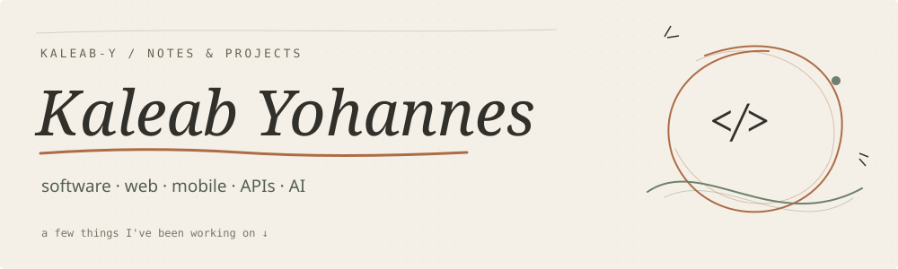
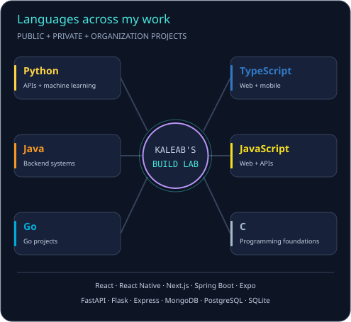

Hi, I'm Kaleab. I build web and mobile apps, work on backend APIs, and experiment with Python and AI tools. Some of my work is here; some lives in private repositories and team projects.

  
  
  

## A few projects

**[AI Tracker](https://github.com/Kaleab-y/AI-tracker)** — A local dashboard for seeing where AI requests spend tokens, time, and money. FastAPI on the backend, Next.js on the front.

**[Kulli](https://github.com/Kaleab-y/Demo_Truck_delivery_app)** — A truck-delivery demo with trip requests, estimates, and separate customer and truck-owner dashboards. Built with Flask.

**[Olympic medal prediction](https://github.com/Kaleab-y/beginner_ml_project)** — A tutorial-based Python notebook project for working through historical data and medal predictions.

## What I work with

Also: React Native, Expo, Playwright, Testing Library, pandas, NumPy, scikit-learn, and Jupyter.

## By the numbers

How I counted these

This is a snapshot of 14 reviewed projects, including public, private, and organization work. Each project counts once per selected implementation language. AI Tracker counts for both Python and TypeScript, so the percentages can add up to more than 100%. HTML and CSS are left out of this language comparison.

The sample includes my public projects and seven private or organization projects. Private project names are kept out of this profile.

Activity totals above cover public repositories; the streak card includes anonymous private contributions.

Visual credits

Original notebook artwork. Logos from [Skill Icons](https://github.com/tandpfun/skill-icons); activity cards from [GitHub Stats Extended](https://github.com/stats-organization/github-stats-extended) and [Streak Stats](https://github.com/DenverCoder1/github-readme-streak-stats).

