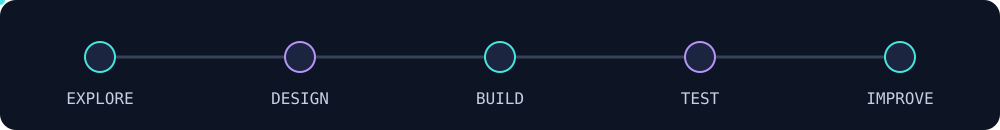

  

  

  
  

## 👋 Behind the builds

I'm **Kaleab**, a software developer working across web interfaces, backend services, mobile apps, and AI tooling. My work ranges from React dashboards and API integrations to Java backend simulations, Python experiments, and programming fundamentals.

Some of that work lives in private and organization repositories. The toolbox below reflects that broader experience, while the projects here give you public code to explore.

## 🧰 My toolbox

### Languages

### Web & mobile

  

### Backend & data

### Build, test & deploy

 

### AI & notebooks

   

## 🚀 Open the lab

### 🛰️ [AI Tracker](https://github.com/Kaleab-y/AI-tracker)
A local AI telemetry platform: a FastAPI proxy and Next.js dashboard for exploring token usage, estimated costs, and request latency.

### 🚚 [Kulli · Truck Delivery Demo](https://github.com/Kaleab-y/Demo_Truck_delivery_app)
A Flask application connecting customers with truck owners through trip requests, distance and price estimates, dashboards, and status updates.

### 🌱 [Agri-Smart](https://github.com/birukabza/Agri-Smart)
A collaborative project in my public portfolio. Explore the repository for the implementation and team context.

### 🧪 [Olympic Medal Prediction](https://github.com/Kaleab-y/beginner_ml_project)
A tutorial-based machine learning experiment using historical Olympic data, Python notebooks, pandas, and scikit-learn.

## ⚡ The build loop

The foundations matter too: my [ALX coursework](https://github.com/Kaleab-y/alx-low_level_programming) and [data structures & algorithms practice](https://github.com/Kaleab-y/DSA_questions) document the work behind the applications.

🎨 Design notes & credits

An original Build Lab theme with animated circuit signals and a terminal cursor. Technology artwork uses [Skill Icons](https://github.com/tandpfun/skill-icons) and [Simple Icons through Shields.io](https://shields.io/). The animated headline uses [Readme Typing SVG](https://github.com/DenverCoder1/readme-typing-svg).

Inspired by the visual variety in [Awesome GitHub Profile READMEs](https://github.com/abhisheknaiidu/awesome-github-profile-readme) and the grouped tool sections in [DenverCoder1's profile](https://github.com/DenverCoder1/DenverCoder1), adapted around my own projects and stack.

